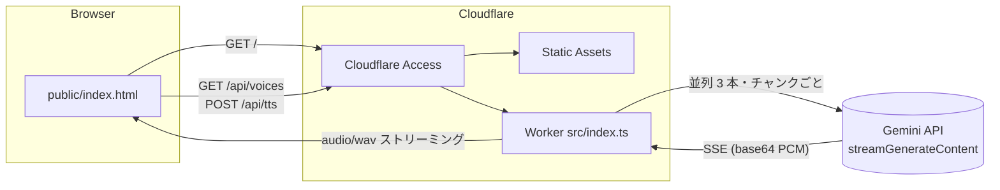
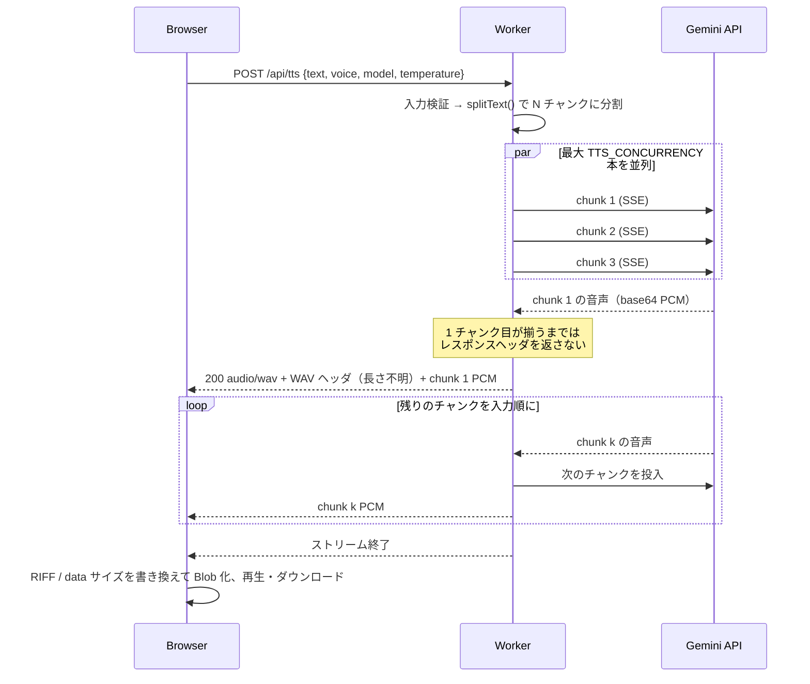

# Gemini TTS on Cloudflare Workers — 技術ドキュメント

このドキュメントは、本リポジトリの設計・実装・運用を開発者向けにまとめたものです。
利用手順だけを知りたい場合は [README.md](../README.md) を参照してください。

- 対象コミット: `main`（2026-09-14 時点）
- 対象読者: Worker を改修・運用する開発者

## 目次

1. [概要](#1-概要)
2. [リポジトリ構成](#2-リポジトリ構成)
3. [アーキテクチャ](#3-アーキテクチャ)
4. [リクエストの流れ](#4-リクエストの流れ)
5. [HTTP API 仕様](#5-http-api-仕様)
6. [Worker の内部構造](#6-worker-の内部構造)
7. [フロントエンド](#7-フロントエンド)
8. [設定](#8-設定)
9. [設計上の判断と制約](#9-設計上の判断と制約)
10. [運用](#10-運用)
11. [テストと検証](#11-テストと検証)
12. [トラブルシューティング](#12-トラブルシューティング)
13. [変更履歴](#13-変更履歴)

---

## 1. 概要

Google AI Studio が出力する `google-genai` の Python サンプル（`gemini-2.5-pro-preview-tts` で
テキストを読み上げ、PCM に WAV ヘッダを付けて保存するスクリプト）を、Cloudflare Workers 上で動く
Web アプリとして移植したものです。

| 項目 | 内容 |
| --- | --- |
| 実行基盤 | Cloudflare Workers + Workers Static Assets |
| 言語 | TypeScript（Worker）、素の HTML / JavaScript（フロント） |
| 外部 API | Gemini API `streamGenerateContent?alt=sse`（音声モード） |
| 出力 | 24 kHz / 16 bit / モノラル PCM の WAV |
| 認証 | Worker の Secret に Gemini API キー。アプリ全体は Cloudflare Access で保護 |
| 依存パッケージ | 実行時依存なし。開発時のみ `wrangler`, `typescript`, `@cloudflare/workers-types` |

ブラウザには API キーを渡しません。Gemini との通信はすべて Worker が仲介します。

## 2. リポジトリ構成

```
.
├── src/
│   ├── index.ts          Worker 本体（ルーティング、分割、Gemini 呼び出し、WAV 化、ストリーミング）
│   └── node-buffer.d.ts  node:buffer の最小型定義（workers-types に含まれないため）
├── public/
│   └── index.html        フロントエンド（単一ファイル。Static Assets として配信）
├── test/
│   ├── unit.test.mjs     純粋関数のユニットテスト（npm test）
│   └── mock-gemini.mjs   ローカル E2E 用の Gemini モックサーバー
├── docs/
│   └── TECHNICAL.md      本ドキュメント
├── wrangler.jsonc        Worker の設定
├── package.json          スクリプトと開発依存
├── tsconfig.json         型チェック設定（noEmit。バンドルは wrangler が行う）
├── .dev.vars.example     ローカル開発用の環境変数テンプレート
└── README.md             利用手順
```

## 3. アーキテクチャ



- **Static Assets** が `public/` を配信します。`/api/*` は静的ファイルに一致しないため Worker に渡ります。
  Worker 側でも未知のパスは `env.ASSETS.fetch()` に委譲します。
- **Cloudflare Access** はダッシュボード側の設定であり、リポジトリには含まれません。
  Worker のルート全体（`/api/tts` を含む）に適用されている前提です。

## 4. リクエストの流れ

`POST /api/tts` 1 回の処理を時系列で示します。



要点:

1. **最初のチャンクが完成するまでヘッダを返さない**。これにより API キー不正や安全性ブロックなどの
   エラーを JSON とステータスコードで返せます。ヘッダ送信後に失敗した場合はストリームを abort します。
2. **チャンクは並列に生成し、入力順に送出**します（`inOrder`）。
3. **WAV ヘッダのサイズ欄は `0xFFFFFFFF`（長さ不明）** で送り、ブラウザが受信完了後に正しい値へ書き換えます。

## 5. HTTP API 仕様

### `GET /api/voices`

利用可能なボイスとモデルの一覧。フロントはこれで `<select>` を組み立てます。

```json
{
  "voices": ["Zephyr", "Puck", "..."],
  "models": ["gemini-2.5-pro-preview-tts", "gemini-2.5-flash-preview-tts", "gemini-3.1-flash-tts-preview"],
  "defaultVoice": "Zephyr",
  "defaultModel": "gemini-2.5-pro-preview-tts"
}
```

### `POST /api/tts`

リクエスト本文（JSON）:

| フィールド | 型 | 必須 | 既定値 | 備考 |
| --- | --- | --- | --- | --- |
| `text` | string | ○ | — | 前後の空白は除去。最大 20,000 文字（`MAX_TEXT_LENGTH`） |
| `voice` | string | | `Zephyr` | 許可リスト外の値は既定値に置き換え（エラーにはしない） |
| `model` | string | | `gemini-2.5-pro-preview-tts` | 同上 |
| `temperature` | number | | `1` | 0〜2 の範囲外は既定値 |

成功時: `200 OK`、本文は WAV をストリーミング。主なレスポンスヘッダ:

| ヘッダ | 内容 |
| --- | --- |
| `Content-Type` | `audio/wav` |
| `Content-Disposition` | `attachment; filename="tts-<voice>-<UTC timestamp>.wav"` |
| `X-Sample-Rate` / `X-Bits-Per-Sample` | Gemini が返した MIME から解析した値（通常 24000 / 16） |
| `X-Chunks` | 分割数 |
| `X-Gemini-Model` / `X-Gemini-Voice` | 実際に使ったモデルとボイス |
| `X-Source-Mime-Type` | Gemini の MIME（例 `audio/L16;codec=pcm;rate=24000`） |
| `Cache-Control` | `no-store` |

`Content-Length` は付きません（長さ不明のストリーミング）。

エラー時: JSON `{ "error": string, ...extra }`。

| ステータス | 意味 |
| --- | --- |
| 400 | 本文が JSON でない、`text` が空、長すぎる |
| 405 | POST 以外 |
| 422 | Gemini が安全性でブロック（`promptFeedback.blockReason`） |
| 429 / 4xx | Gemini の 4xx をそのまま透過（クォータ超過など）。メッセージは Gemini のものを転記 |
| 500 | `GEMINI_API_KEY` 未設定 |
| 502 | リトライ枯渇、音声なし（`finishReason`, `text`, `chunk` を添付）、その他の上流エラー |

**ヘッダ送信後**のエラーは HTTP ステータスに反映できません。ストリームが途中で切れるため、
ブラウザ側では `fetch` の読み取りエラーになります（Observability のログに `tts stream failed` が出ます）。

## 6. Worker の内部構造

`src/index.ts` は単一ファイルで、次の責務に分かれています。

### 6.1 ルーティングと入力検証（`fetch`, `handleTts`）

- `/api/tts` は POST のみ。`/api/voices` は一覧を返す。それ以外は `env.ASSETS.fetch()`。
- `voice` / `model` は許可リスト（`VOICES`, `MODELS`）で検証し、リスト外なら既定値にフォールバックします。
  これは Gemini へ任意のモデル名を渡さないための措置でもあります。

### 6.2 テキスト分割（`splitText(text, maxChars)`）

1. 改行で段落に分ける。
2. 各段落を文に分ける。文末の判定は `。！？!?` の連続、または「数字の直後でない `.` + 空白」。
   後者は `2.5` のような小数を分断しないための条件です。
3. 文を `maxChars` を超えない範囲で貪欲に詰める。段落の切れ目はチャンク内に `\n` として残し、
   モデルが自然に間を取れるようにする。
4. 1 文が `maxChars` を超える場合のみ文字数で強制分割する。

チャンク境界は常に文末か段落末になります。元記事（3,348 文字）は 300 文字設定で 13 チャンクになります。

### 6.3 順序付き並列実行（`inOrder(items, concurrency, fn)`）

非同期ジェネレータ。最大 `concurrency` 個の Promise を同時に走らせ、**入力順**に結果を yield します。
i 番目を await して yield したら次の 1 件を投入する、スライディングウィンドウ方式です。

- 後続チャンクが先に失敗した場合の unhandled rejection を避けるため、各 Promise に空の `catch` を付けています。
  例外は await した時点で呼び出し側に伝播します。
- yield 済みの結果は配列から外して参照を切ります。1 チャンク分の PCM は 2〜3 MB あるため、
  ここで解放しないと 13 チャンクで 30 MB 以上を抱えることになります。

### 6.4 Gemini 呼び出し（`synthesizeChunk(params, attempt)`）

- エンドポイント: `{GEMINI_API_BASE}/models/{model}:streamGenerateContent?alt=sse`
- ヘッダ: `x-goog-api-key`
- 本文: `contents[0].parts[0].text` にチャンク、`generationConfig` に `temperature`,
  `responseModalities: ["AUDIO"]`, `speechConfig.voiceConfig.prebuiltVoiceConfig.voiceName`。
- SSE を `parseSse` で読み、`candidates[0].content.parts[].inlineData` の base64 を復号して結合します。
- **リトライ**: ネットワーク例外、HTTP 429、HTTP 5xx、SSE 内の `error` は指数バックオフ
  （1.5 s, 3 s）で最大 2 回再試行。それ以外の 4xx とブロックは即座に `TtsError` を投げます。
- 音声が 1 バイトも来なかった場合は `finishReason` とテキスト応答を添えて 502 にします。

### 6.5 SSE パーサ（`parseSse(body)`）

`text/event-stream` を **バイト単位**で行に分割し、`data:` 行だけを JSON として yield します。

設計上の注意点: Gemini TTS は 1 チャンク分の音声（数 MB の base64）を 1 行の `data:` として送ります。
文字列連結しながら毎回バッファ全体を `indexOf("\n")` する素朴な実装は二乗オーダーになり、
実際に Worker のリソース上限で打ち切られました（[9.3](#93-cpu-とメモリ)）。
現在の実装は新しく届いた `Uint8Array` の中だけを走査し、行が確定した時点で 1 回だけ結合・デコードします。

- `\r\n` と `\n` の両方に対応。
- `[DONE]`、空行、`data:` 以外の行（`event:`, コメント）は無視。
- 末尾に改行がない最終行も処理します。
- JSON として壊れた行は警告を出して読み飛ばします。

### 6.6 WAV 化（`wavHeader`, `toWav`, `parseAudioMimeType`）

- `parseAudioMimeType` は `audio/L16;codec=pcm;rate=24000` から `bitsPerSample=16`, `rate=24000` を取り出します。
  取り出せない場合の既定値も 16 / 24000 です。
- `wavHeader(dataSize, bits, rate)` は 44 バイトの RIFF/WAVE ヘッダ（モノラル PCM）を作ります。
  `dataSize` に `0xFFFFFFFF` を渡すと RIFF サイズも `0xFFFFFFFF` になり、「長さ不明」のストリーミング用ヘッダになります。
- `toWav` は長さ確定版で、テストと将来の非ストリーミング用途のために残しています。

### 6.7 base64 復号（`base64ToBytes`）

`nodejs_compat` フラグで使える `node:buffer` の `Buffer.from(b64, "base64")` を使います。
`atob` + 1 バイトずつの JS ループは 25 MB 規模では遅すぎるためです。戻り値は `Uint8Array` のビューに変換します。
型定義は `src/node-buffer.d.ts` に最小限だけ書いています（`@types/node` を入れると workers-types と衝突するため）。

### 6.8 ストリーミング送出

`TransformStream` の `readable` を `Response` 本文にし、`writable` 側へ `ctx.waitUntil()` で非同期に書き込みます。
順序は「ヘッダ → 1 チャンク目の PCM → 以降入力順」。途中で例外が起きたら `writer.abort()` でストリームを切ります。

## 7. フロントエンド

`public/index.html` は依存なしの単一ファイルです。

- 起動時に `/api/voices` を取得して `<select>` を構築。失敗時は既定値だけの一覧にフォールバック。
- テキストエリアには元の Python サンプルの記事が初期値として埋め込まれています。
- 送信後は `res.body.getReader()` で逐次読み取り、受信済み KB を表示します。
- 受信完了後、WAV のオフセット 4（RIFF サイズ）と 40（data サイズ）を実サイズで上書きし、
  `Blob` にして `<audio>` と `<a download>` に渡します。
- エラー時は JSON の `error` を表示。JSON でなければ `HTTP <status>` を表示します
  （後者は Cloudflare 自身のエラーページであることが多い。[12](#12-トラブルシューティング) 参照）。
- 配色は `prefers-color-scheme` に追従します。

## 8. 設定

### 8.1 `wrangler.jsonc`

| キー | 値 | 理由 |
| --- | --- | --- |
| `main` | `src/index.ts` | wrangler が esbuild でバンドル |
| `compatibility_date` | `2025-09-01` | |
| `compatibility_flags` | `["nodejs_compat"]` | `node:buffer` を使うため |
| `assets.directory` | `./public` | 静的配信 |
| `assets.binding` | `ASSETS` | Worker から `env.ASSETS.fetch()` で委譲 |
| `observability.enabled` | `true` | ダッシュボードでリクエスト単位の CPU / 壁時計時間とログを見るため |

### 8.2 環境変数と Secret

| 名前 | 種別 | 既定値 | 説明 |
| --- | --- | --- | --- |
| `GEMINI_API_KEY` | Secret（必須） | — | `npx wrangler secret put GEMINI_API_KEY`。ローカルは `.dev.vars` |
| `GEMINI_API_BASE` | var | `https://generativelanguage.googleapis.com/v1beta` | 主にテスト用。モックサーバーへ向ける |
| `TTS_CHUNK_CHARS` | var | `300` | 1 リクエストあたりの最大文字数 |
| `TTS_CONCURRENCY` | var | `3` | Gemini への同時リクエスト数 |

`vars` は `wrangler.jsonc` に `"vars": { "TTS_CHUNK_CHARS": "400" }` のように書くか、ダッシュボードで設定します。
数値として解釈できない値は既定値に戻ります。

### 8.3 コード内の定数

| 定数 | 値 | 説明 |
| --- | --- | --- |
| `MAX_TEXT_LENGTH` | 20,000 | 入力上限（文字） |
| `MAX_RETRIES` | 2 | チャンクごとの再試行回数 |
| `MODELS` / `VOICES` | 一覧 | 許可リスト。モデル追加はここに 1 行足すだけでフロントにも反映される |

## 9. 設計上の判断と制約

このセクションは「なぜこうなっているか」の記録です。いずれも実際の障害から得た知見です。

### 9.1 Cloudflare の 100 秒オリジンタイムアウト（HTTP 524）

Worker からの外部 `fetch` は、相手が約 100 秒間 1 バイトも返さないと Cloudflare 側で切断され、
HTTP 524 のエラーページが返ります。Gemini TTS の生成時間は音声長に比例し、300 文字で 30〜40 秒、
1,300 文字では 100 秒を超えました。非ストリーミングの `generateContent` では必ずこれに当たります。

### 9.2 Gemini TTS は SSE でも先頭バイトを早く返さない

`streamGenerateContent?alt=sse` に切り替えても 524 は解消しませんでした。TTS モデルは発話全体を
生成し終えてから送り始めるため、最初のバイトまでの時間が短くならないからです。
したがって **リクエスト自体を短くする**（チャンク分割）以外に回避策がありません。
これが [6.2](#62-テキスト分割splittexttext-maxchars) と [6.3](#63-順序付き並列実行inorderitems-concurrency-fn) の理由です。

SSE を使い続けているのは、将来モデルが本当にストリーミングするようになった場合に恩恵を受けるためと、
非ストリーミングに戻す理由がないためです。

### 9.3 CPU とメモリ

Workers の上限は有料プランで CPU 30 秒 / リクエスト、メモリ 128 MB / isolate です。
音声は 24 kHz・16 bit で **1 分あたり約 3 MB**、元記事（7 分）で約 20 MB になります。

初期実装は次の 3 点で上限に達し、Cloudflare から JSON でない 503 が返りました。

1. SSE の文字列連結と全体再走査（二乗オーダー）
2. base64 の 1 バイトずつの JS ループ
3. 完了済みチャンクの PCM を最後まで保持

修正後の実測は、元記事全体で CPU 716 ms、壁時計 3 分 9 秒です（Observability の値）。
壁時計のほぼすべてが Gemini の応答待ちです。

### 9.4 WAV ヘッダの長さ不明問題

ストリーミング開始時点では総サイズが分からないため、RIFF / data サイズを `0xFFFFFFFF` にしています。
多くのプレイヤーと ffmpeg はこれを「不明」として扱えますが、厳密なツールでは警告が出ます。
ブラウザ経由では受信後に書き換えるので問題ありません。curl で保存した場合は
`ffmpeg -i in.wav -c copy out.wav` で正規化できます。

### 9.5 チャンク境界の品質

チャンクごとに独立して生成するため、境界で話速・声質・間がわずかに変わることがあります。
文末・段落末でしか切らないことで目立ちにくくしています。より滑らかにしたい場合は
`TTS_CHUNK_CHARS` を上げてリクエスト数を減らしてください（[9.1](#91-cloudflare-の-100-秒オリジンタイムアウトhttp-524) の制約内で）。

### 9.6 Gemini の無料枠クォータ

`gemini-2.5-pro-tts` の無料枠は **1 日 50 リクエスト**（`generate_requests_per_model_per_day`）です。
分割によりリクエスト数が増えるため、記事 3〜4 本で使い切ります。上限は **モデルごとに別**なので、
画面でモデルを切り替えれば当日中も継続できます。恒久的には課金の有効化が必要です。
429 は現状 2 回リトライしますが、日次上限の 429 はリトライしても回復しません（改善余地）。

### 9.7 セキュリティ

- API キーは Secret のみ。レスポンスやログには出しません。
- `model` / `voice` は許可リストで固定し、任意の文字列を Gemini の URL に含めません。
- アプリ全体は Cloudflare Access で保護されている前提で、Worker 自身は認証を実装していません。
  Access を外す場合は、`/api/tts` に何らかの認証・レート制限を追加してください。
  無保護で公開すると API キーの利用料を第三者に消費されます。

## 10. 運用

### 10.1 デプロイ

```sh
npm install
npx wrangler login                    # 初回のみ
npx wrangler secret put GEMINI_API_KEY # 初回のみ
npm run deploy
```

`main` にマージしたら `git pull` してから `npm run deploy` します。`wrangler.jsonc` を変更した PR
（例: `nodejs_compat` の追加）は、古い設定でデプロイすると起動時に失敗するため特に注意してください。

### 10.2 ローカル開発

```sh
cp .dev.vars.example .dev.vars   # GEMINI_API_KEY を記入
npm run dev                       # http://localhost:8787
```

実 API を使わずに動作確認する場合は [11.2](#112-モックサーバーによる-e2e) を参照。

### 10.3 監視

ダッシュボード → Workers & Pages → `gemini-tts` → **Observability** で、リクエストごとの
CPU Time / Wall Time と `console.*` の出力を確認できます。目安:

| 状況 | CPU | Wall |
| --- | --- | --- |
| 正常（元記事全体、13 チャンク、並列 3） | 約 0.7 s | 約 3 分 |
| 短文（1〜2 チャンク） | 数十 ms | 30〜40 s |

CPU が秒単位に膨らんでいる、または Wall が数十秒で終わって 503 になっている場合は、
リソース上限（[9.3](#93-cpu-とメモリ)）を疑ってください。

### 10.4 チューニング

| 目的 | 変更 | トレードオフ |
| --- | --- | --- |
| 速くしたい | `TTS_CONCURRENCY` を 4〜5 に | Gemini の分あたりレート制限（429）に当たりやすい |
| 継ぎ目を減らしたい / リクエスト数を減らしたい | `TTS_CHUNK_CHARS` を 400〜450 に | 1 チャンクの生成が 100 秒に近づく。524 が出たら戻す |
| 524 が出る | `TTS_CHUNK_CHARS` を 200 に | リクエスト数と継ぎ目が増える |

## 11. テストと検証

### 11.1 ユニットテスト

```sh
npm test
```

`test/unit.test.mjs` が `src/index.ts` を Node 22 の `--experimental-strip-types` で直接読み込み、
純粋関数をテストします（追加の依存なし）。

| 対象 | 検証内容 |
| --- | --- |
| `parseAudioMimeType` | rate / bits の抽出と既定値 |
| `wavHeader` / `toWav` | 44 バイトヘッダの各フィールド、長さ不明ヘッダ |
| `parseSse` | 読み取り境界をまたぐ行、CRLF、コメント行、`[DONE]`、末尾改行なし、壊れた JSON の読み飛ばし |
| `splitText` | 上限遵守、テキスト欠落なし、境界が文末か段落末、小数を分断しない、強制分割、空入力 |
| `inOrder` | 入力順の結果、同時実行数の上限、例外の伝播 |

`src/index.ts` の named export は関数だけにしてください。workerd はモジュールの named export に
関数・オブジェクト以外（数値定数など）があると起動時に拒否します。

### 11.2 モックサーバーによる E2E

実 API を消費せずに分割・並列・順序・リトライ・ストリーミングを通しで確認できます。

```sh
node test/mock-gemini.mjs &                       # :9999
printf 'GEMINI_API_KEY=test\nGEMINI_API_BASE=http://127.0.0.1:9999/v1beta\n' > .dev.vars
npx wrangler dev &
curl -X POST localhost:8787/api/tts -H 'Content-Type: application/json' \
     -d '{"text":"こんにちは。世界。"}' -D - -o out.wav
```

モックは 1 チャンクあたり約 2.4 MB（実機相当）の「PCM」を、呼び出し番号で埋めて返します。
出力ファイルの先頭 44 バイト以降が `1,1,...,2,2,...` と並んでいれば順序が正しいことになります。
3 回目の呼び出しは必ず 429 を返すので、リトライの動作も確認できます。

`.dev.vars` はコミットしないでください（`.gitignore` 済み）。

### 11.3 型チェックとドライラン

```sh
npm run check   # tsc --noEmit && wrangler deploy --dry-run && npm test
```

## 12. トラブルシューティング

| 症状 | 原因 | 対処 |
| --- | --- | --- |
| `Gemini API error: HTTP 524` | 1 チャンクの生成が 100 秒超 | `TTS_CHUNK_CHARS` を下げる |
| `HTTP 503`（JSON でない） | Worker のリソース上限超過 | Observability で CPU / メモリを確認。コードの効率か入力サイズを見直す |
| `Gemini API error: You exceeded your current quota ... per_day` | 無料枠の日次上限 | モデルを切り替える、または課金を有効化 |
| `Gemini API error: API key not valid` | Secret 未設定 / 誤り | `npx wrangler secret put GEMINI_API_KEY` |
| `Request was blocked: SAFETY` | 入力が安全性フィルタに抵触 | 該当箇所を修正 |
| `Gemini returned no audio.` + `text` | モデルが音声でなくテキストで応答 | 応答テキストを確認。モデル名や `responseModalities` を疑う |
| モデル追加後に 404 | そのアカウント / リージョンで未提供 | Gemini 側のメッセージを確認 |
| ダウンロードした WAV の再生時間が不正 | curl 等で保存し長さ不明ヘッダのまま | `ffmpeg -i in.wav -c copy out.wav` |
| ローカルで `Incorrect type for map entry` | 関数以外を named export した | export を外す |

## 13. 変更履歴

| PR | 内容 |
| --- | --- |
| [#1](https://github.com/buchi1988/260914-tts/pull/1) | 初版。非ストリーミングの `generateContent` で WAV を返す |
| [#2](https://github.com/buchi1988/260914-tts/pull/2) | SSE ストリーミング化。長さ不明 WAV ヘッダとブラウザ側の書き換え |
| [#3](https://github.com/buchi1988/260914-tts/pull/3) | 文単位のチャンク分割と順序付き並列実行、リトライ |
| [#4](https://github.com/buchi1988/260914-tts/pull/4) | バイト単位 SSE パーサ、ネイティブ base64、結果の即時解放。`nodejs_compat` 追加 |
| [#5](https://github.com/buchi1988/260914-tts/pull/5) | `gemini-3.1-flash-tts-preview` を追加 |
